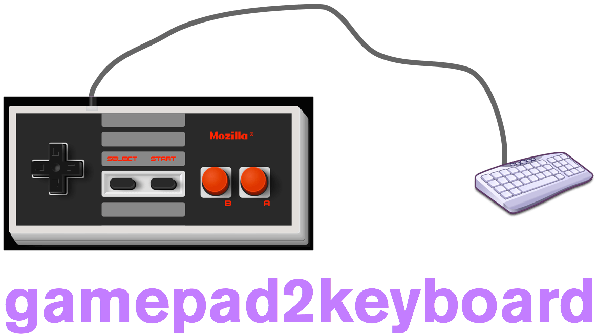

# gamepad2keyboard

Synthesises JavaScript browser keyboard events from button/axis changes from the Gamepad API (`navigator.getGamepads`).

## Installation

### npm

1. Install from npm:

        npm install gamepad2keyboard

### GitHub

1. Clone the git repository from GitHub:

        git clone git@github.com:cvan/gamepad2keyboard.git

2. Open the working directory:

        cd gamepad2keyboard

3. Install the Node dependencies:

        npm install

## Development

To run the file watchers, run this from the command line:

    npm run watch

## Licence

[MIT Licence](LICENCE)

## Contributing

[Contributions are very welcome!](CONTRIBUTING.md)
